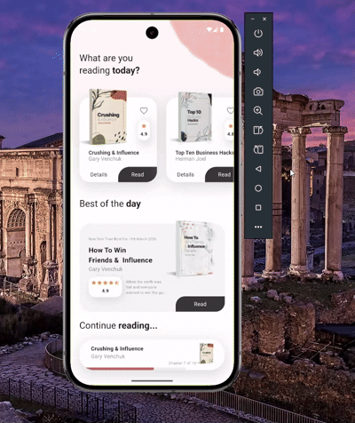

  

# 📚 Flutter eBook App

A beautiful eBook app UI built with Flutter. This app demonstrates modern design patterns and best practices for Flutter development.

  
  
  
  
  

## 🌟 Features

- Clean and modern UI design
- Smooth animations and transitions
- Interactive book cards with ratings
- Detailed book view with chapters
- Progress tracking
- Favorite book marking
- Responsive layout

## 📱 App Screenshots

  
   
  

## 🛠️ Components Structure

## 🎯 Key Features Explained

### 1. Interactive Book Cards
- Scale animation on tap
- Favorite button with state management
- Rating display
- Read/Details buttons

### 2. Book Details Screen
- Chapter listing
- Reading progress
- Book information
- Favorite toggle
- Rating system

### 3. Animations
- Card scale on press
- Smooth transitions
- Progress indicators

## 🎨 Design Elements

### Colors

### Widgets
- `BookRating`: Displays star rating
- `ReadingProgress`: Shows reading progress
- `ReadingListCard`: Animated book card
- `RoundedButton`: Custom button design

## 🚀 Getting Started

1. Clone the repository

2. Install dependencies

3. Run the app

## 📝 Requirements

- Flutter 3.6.0 or higher
- Dart SDK ^3.6.0

## 🤝 Contributing

Feel free to contribute to this project by:
1. Forking the repository
2. Creating your feature branch
3. Committing your changes
4. Pushing to the branch
5. Creating a Pull Request

## 🙏 Acknowledgments

- Design inspiration from various eBook apps
- Flutter community for awesome packages
